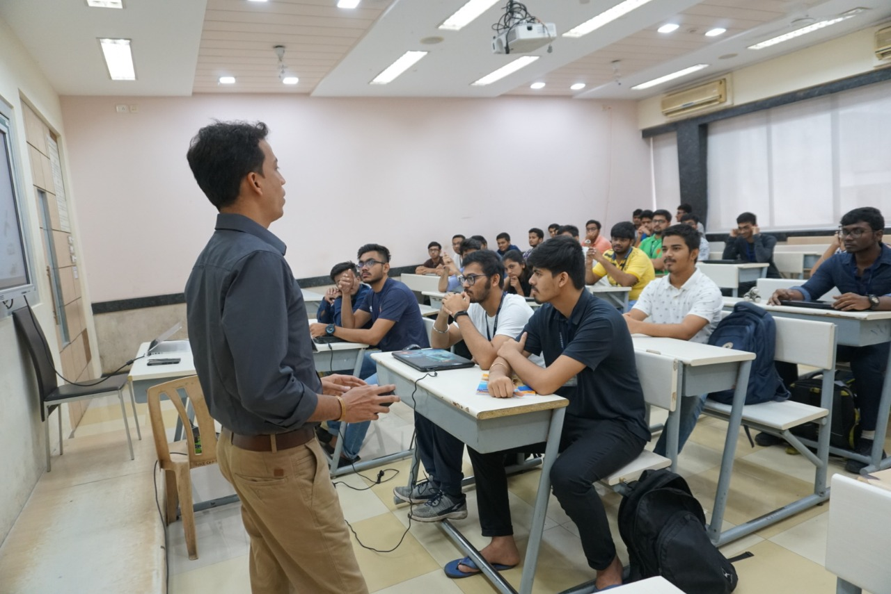

 

- IEEE brainwaves came up with seminars on Blockchain and Embedded C which were been conducted by Prof. Pranav Shastri( Asst.Prof. BSc. IT ) on Feb 1st. Following important points were covered in the seminar Legacy Centralized System ,Need of Decentralization, Introduction to Blockchain Tech, Smart Contract, .DApps & DAO, World’s perception of Blockchain, Generic Blockchain Use cases, Blockchain in Electronics, Blockchain in Telecommunication ,Future stance of Blockchain in India. Thus, the seminar gave them the chance to learn blockchain use features of 'C'to create structured embedded code.
