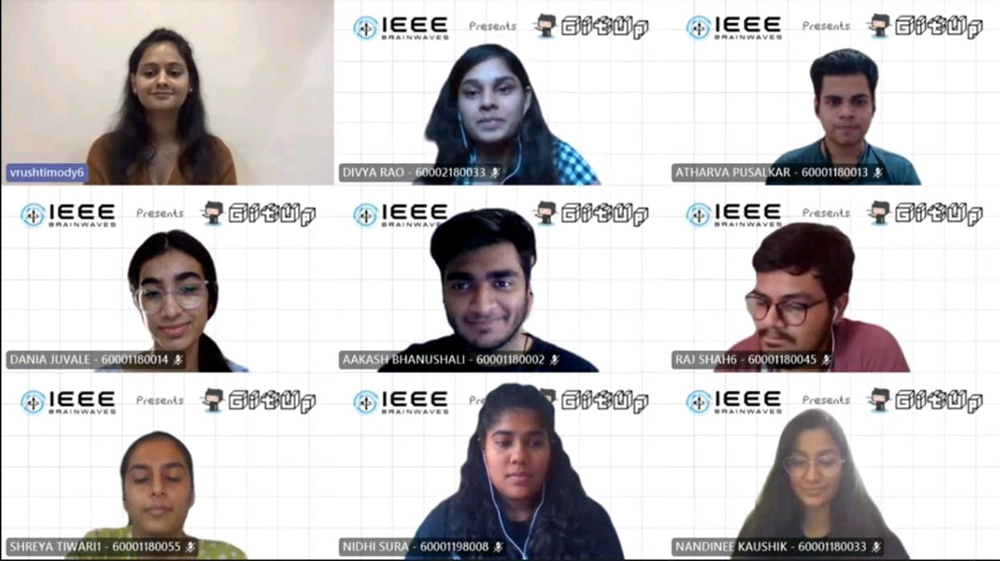

 

- Gitup was conducted by Vrushti Mody, SDE at Holosuit and an Economic Times Campus Star'2020. She was also declared the winner of IBM hack challenge 2019 and Hackerearth's Recruit-a-thon'2020. The session started with Introduction to Open source where the basics of Git and Github were also covered. The attendees were provided with a document comprising of detailed steps for downloading and setting up Git and Github accounts. The queries for the same were taken up before the start of the session. The speaker was successful in guiding the attendees through the process of going from a starter to a winner. Opportunities like Gsoc and MLH and their significance was also discussed.
