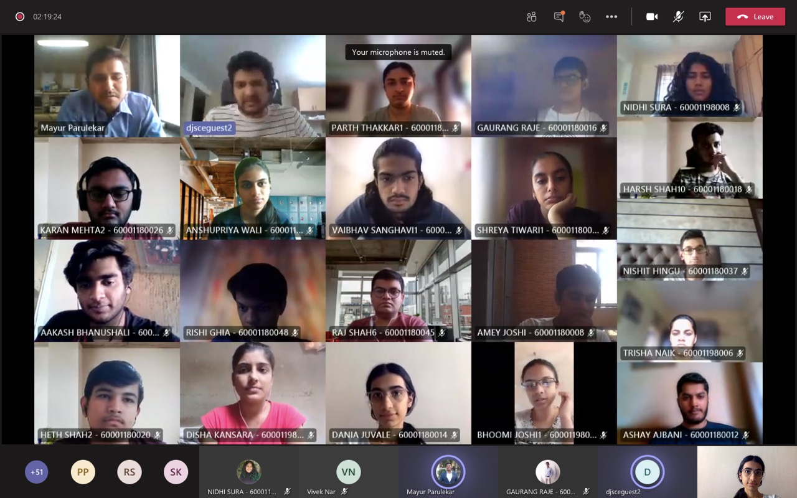

 

- CAN protocols and implementation of RTOS was a workshop conducted by Samuel Ramrajkar, a man with immense experience and knowledge in Embedded systems to explain it to us. The topics covered included how microcontrollers and devices communicate with each other and how to set up such channels through an RTOS. This session marked the start of the Alumni series by IEEE.
