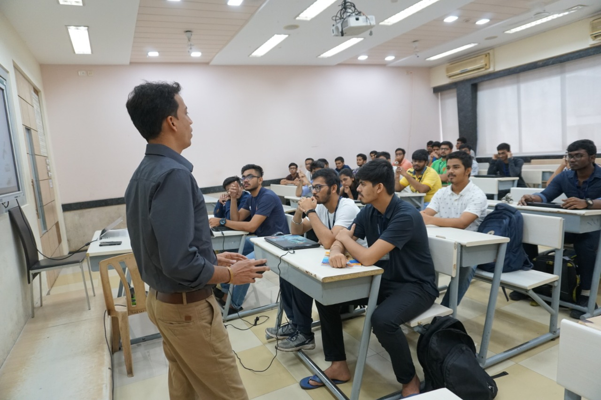

 

- In order to help the students of Third Year to enhance their technical knowledge this will be beneficial for their further respective projects.All the students as they were able to grasp new things, use features of ‘C’ to create structured embedded code, write code that is reliable and responsive. Be comfortable with designing code that adheres to timing constraints and understand the necessity of an Embedded OS.
