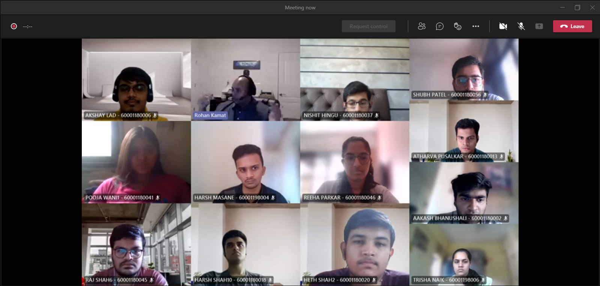

- An essential detail people miss while ensuring security is securing your network 🧑‍💻 and who better than Mr. Rohan Kamat to learn from more about Fortinet Firewalls. Rohan Kamat is a Network Security Professional with 12 years of experience working with many Fortune 500 company. Topics covered in the event:
  1-Introduction to Firewalls, why they are needed and Access Lists
  2- Types of Firewalls & Intrusion Detection Systems
  3- A typical day in the life of Network Security Engineer at Fortinet
  4- Exam Certifications and Opportunities
  5- Demonstration of Firewall Scenarios
  6- What is A DMZ, what does it comprise of and how is it protected
