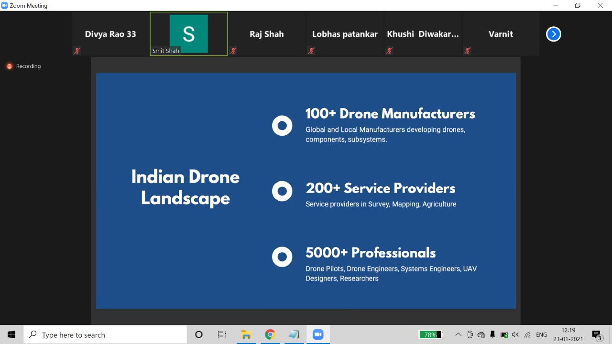

- In collaboration with Drone Federation India, the very first event of the year 2021 was Introduction to the world of drones by Mr. Smit Shah believing in technological advancements through young minds, volunteered to lead this session. He is the Director-partnerships at Drone Federation Of India. The topics covered gave us an overview of drones, their types and critical components. The Use of drones - Domestic and International and the Career as well as Entrepreneurship opportunities were discussed and thought upon, while also covering the basics of Drone Regulations.
