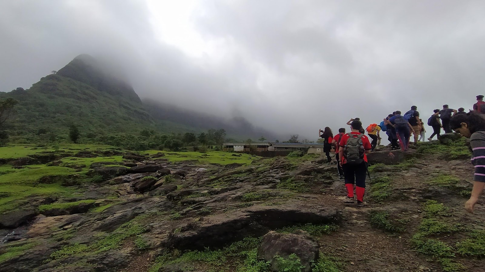

- The day started with a bus full of excitement heading towards Prabalmachi,Panvel. After reaching there, students met the local guide Mr. Namdeo owns a restaurant on the Prabalmachi plateau. Then started the adventurous trek to Prabalmachi; about 2800 feet above the sea level. It nearly took 2 hours to reach the plateau. Though the ascent was tiring for the first timers but they enjoyed the natural beauty throughout the way. After reaching, Mr. Namdeo's family welcomed the IEEE social team. The objectives of this were to To make students socialise with the villagers.Providing an opportunity to the students to interact with villagers and have and adventurous trek experience.
