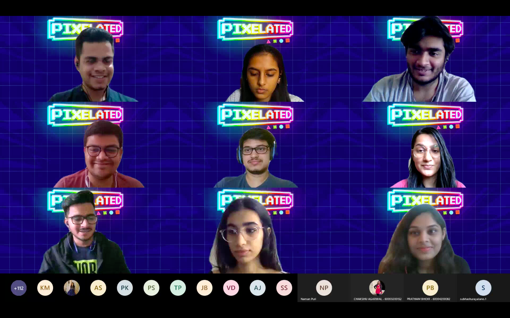

- This workshop was conducted by Sanjay Chauhan covering Adobe Photoshop and turned out to recieve an overwhelming response. Topics covered included creating various effects, Bonus LUTS and color grading among many others. Each topic was explained in detail with all possible situations and designs. Making a project at the end of the workshop also helped in better understanding.
