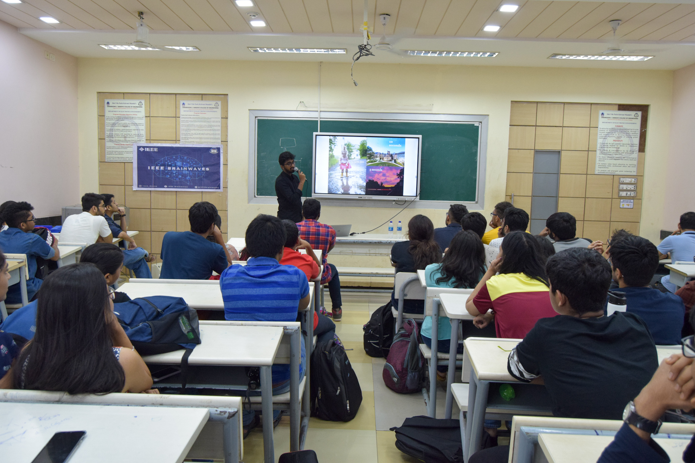

- IEEE arranged a photography workshop in the presence of their Alumni Mr. Jeet Gandhi who himself is an established photographer. He was here to deliver the primary knowledge to amateur photographers. The workshop focused on introducing the students to the concepts and various terms related to snap shooting. He briefed about the ISO settings, aspect ratio, exposure mode, bokeh, aperture, and many more things. An interactive session helped the students to clear their doubts effectively. Lastly, he also advised on buying the correct lenses from the market.
