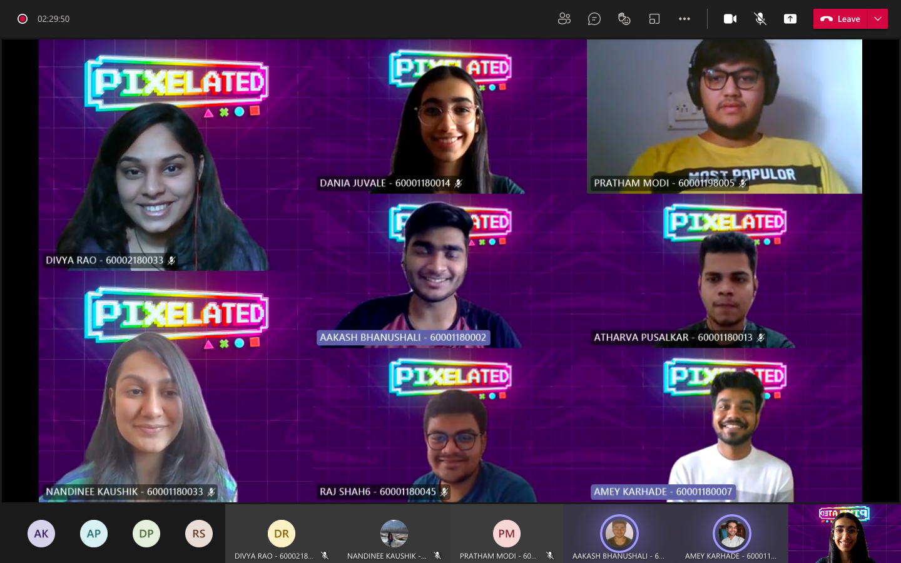

 

- This workshop was conducted by Amey Karhade covering Adobe after effects, and even though it was only basics,a lot of students attended it. Topics covered included creating various effects and Digital Magic, among many others. Each topic was explained in detail with all possible situations and designs. Creating a video at the end of the workshop with the help of step-by-step instructions also helped in grasping the concepts faster.
