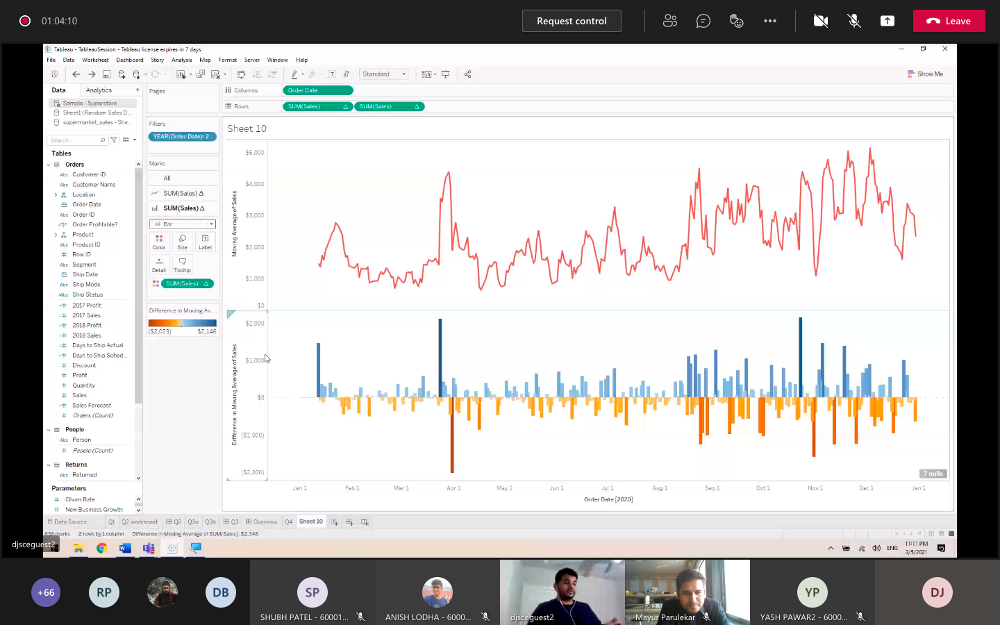

- The webinar was conducted by Sachin Nagda, Assitant Vice President, Bank of America and also an Alumni of DJSCE, marking the second session of the Alumni Chapter by IEEE. He focused on covering the advanced topics for Tableau software in the field of Data Analytics and Business Intelligence. He demonstrated outlier detection on sales figures using Tableau. This helped students looking to pursue a future in the business domain. A few visualisations were also demonstrated helping the students get an idea on how to express their findings on an industrial level
